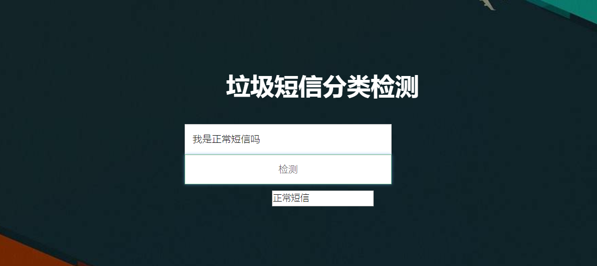

** DJango **   
对于垃圾短信分类问题做一个demo展示  

1.前端ajax+后端Django    
2.训练的数据模型的存放在static中；单例模式保证了训练模型只会加载一次   
3.缺点:  第一次打开页面花费时间较长，需要等待server加载资源完毕。 (异步操作如何解决？？？)
后面python会自动生成pyc文件 将算法model保存到了模块当中

尝试: nginx + uwsgi在生产环境中部署

