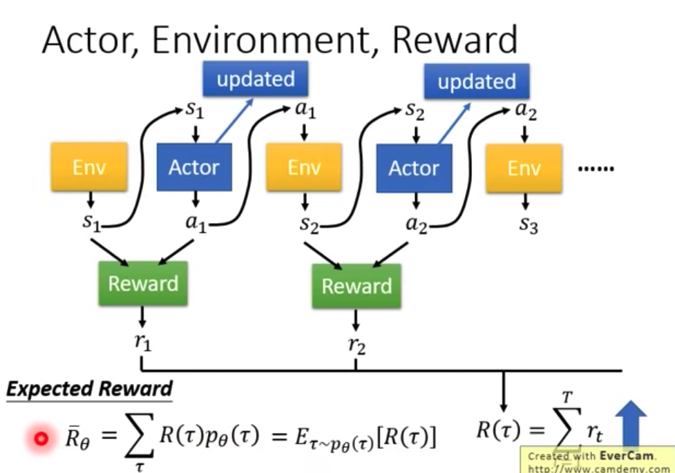
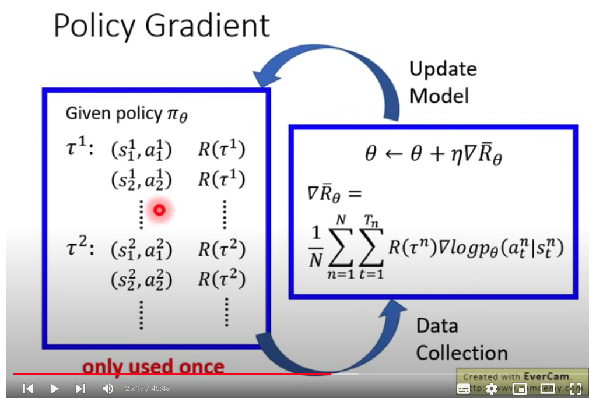
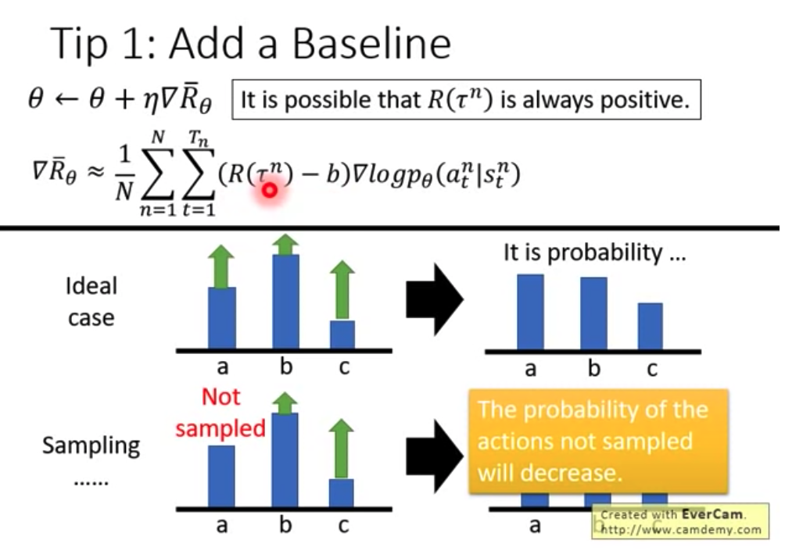
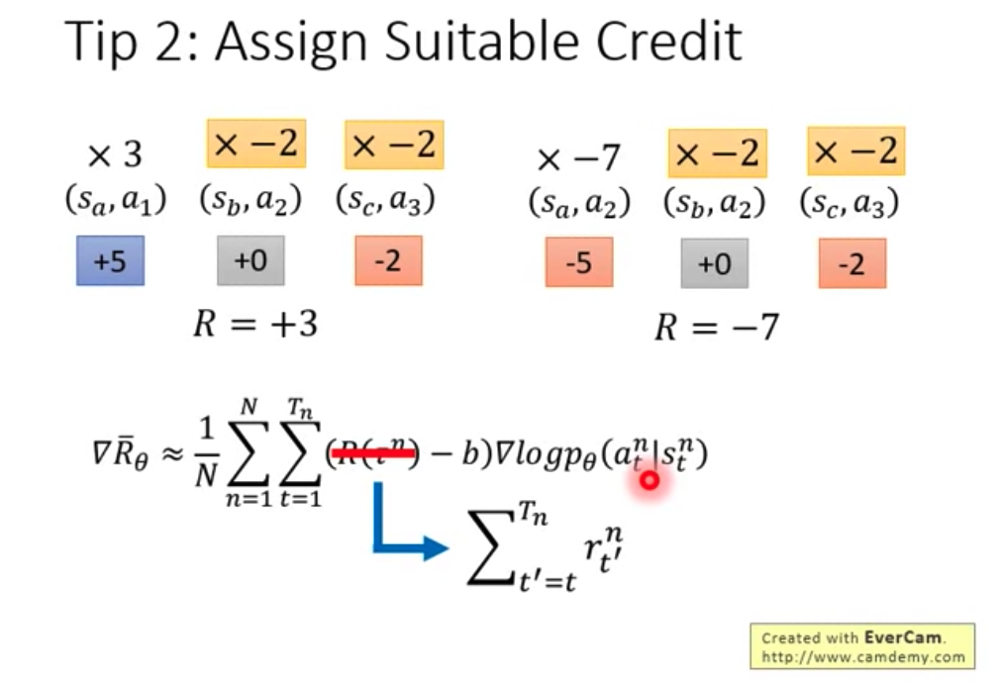

#############################################################  以下是2018年PPO策略的课程
https://youtu.be/z95ZYgPgXOY  Policy Gradient(Review)    
https://youtu.be/OAKAZhFmYoI  PPO
  
**1.Policy Gradient**  
    i.基础知识:  
        Policy = 输入:机器的观察环境的特征  输出:actor目前执行的行为    
        Expected Reward = 奖励的"期望值" （因为由于action、environment的随机性，导致奖励值具有随机性）  
      
  
    ii.如何优化"Reward"的最大值呢？   
```c++  
    // Q1: Actor分类模型的损失函数？ground-truth?  
        // a.损失函数, Weighted的交叉熵; Weighted来自于Reward-Function  
        // b.Ground-Truth, 创建训练资料时, 使用Sampling采样得到一系列的Action. Action作为Ground-Truth  
    
    // Q2: Policy-Gradient 和 Gradient-Descent的区别？  
        // Policy-Gradient是最大化Reward, 更新网络参数时使用Gradient-Ascent(梯度上升)  
```  
    
    Policy Gradient  
    直观理解: 如果State1采用action1，导致最终的Reward是负数，那么就要减少State1采用Action1的概率；否则就增加Action1的概率    
    
**2.训练技巧tips**    
    i.Reward总是正数,会存在哪些问题？ ==> Add a Baseline Score   
   
```c++  
    // BaseLine往往是通过Critic网络计算得到的   (Actor-Critic网络)
```  
    ii."Reward"作为Action的权重，会存在哪些问题？ ==> Assign Suitable Credit   


**3.Proximal Policy Optimization (PPO)**   
1.On-Policy Off-Policy   
    i. 两者的区别?  
        • On-policy: The agent learned and the agent interacting with the environment is the same.  
        • Off-policy: The agent learned and the agent interacting with the environment is different   
   
    ii. 转化为off-policy策略   
        off-policy的训练数据可以反复使用，训练时长更少。 PPO的作用就是将On-Policy策略转化为Off-Policy策略。  
        a.importance sampling   
   
2.PPO是Policy-Gradient的"变型"  