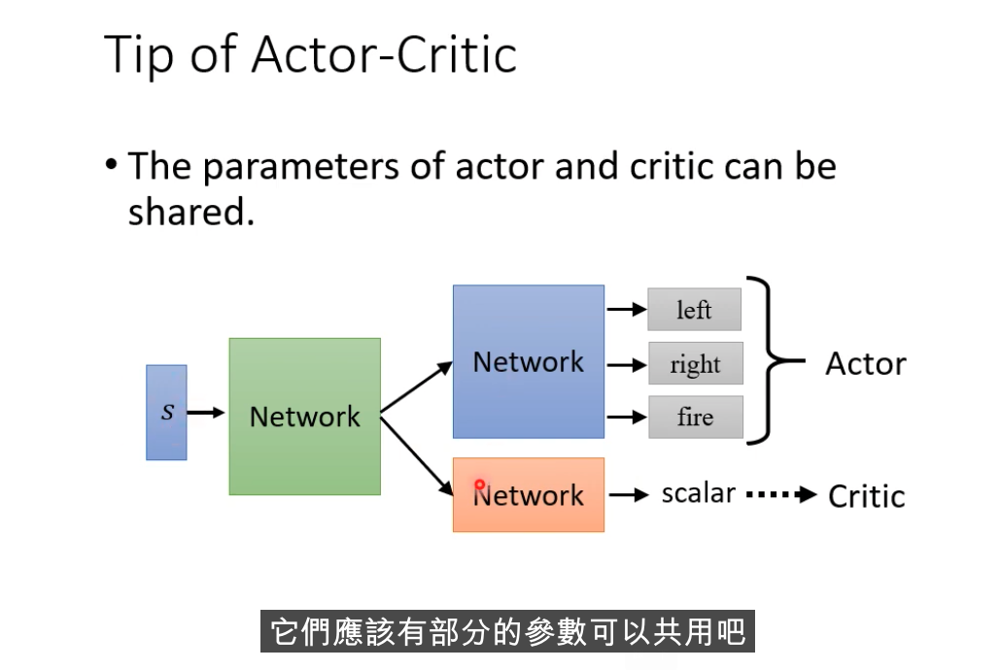

课程资料:    
https://speech.ee.ntu.edu.tw/~hylee/ml/2021-spring.php   2021春季RL课程    
  
```c++  
    // Actor-Critic结构 用于设计Reward函数  
  
    // 1.避免Reward总是正数，因此需要减去BaseLine;   
    // 2.Critic的输出Scalar作为BaseLine, 理解为所有Action的平均Reward  
  
    // 目标: 如何训练分类网络Actor呢？ 如果其Reward是正数，则说明Action是好的选择。否则是坏的选择  
    // Reward函数的设计: 图片version4 （Critic网路）  
```  
  
**i.Critic的具体含义**  
    挑战点: 原始RL方法需要完整训练一轮，才能获取到"Reward"，无法做到"未卜先知"  
    Critic目标:   
        输入: Actor + Env （注意这里没有action）  
        输出: 未来的累计Reward (Scalar, 理解为所有Action的期望Reward）  
*游戏还没有结束，给定游戏画面就已经能估计出，所有Action的Reward期望值*    
    
**ii.如何训练Critic**  
    a.蒙特卡洛 MC方法  
        Actor和Env互动多轮，收集训练资料。使得Critic和Reward越接近越好（简单、直觉）  
  
    b.Temporal（时间）-difference TD方法  
    
        输入: St, at, rt, St+1    游戏画面t, 动作t, 奖励t, 下一步的游戏画面t+1  
        输出: Critic输出Scalar  
        损失函数: Critic输入两次游戏画面，两者之间的差距越接近Rt越好  
    
**iii.如何应用Critic**    
    a.设计Reward, version3.5  
        Critic网络的输出作为BaseLine。  
      
    
    b.设计Reward, version4    
        未来累计Reward, 用t+1时刻的Critic网络来表达，更加平均。    
      
    
    c.训练技巧    
        Actor网络、Critic网络可以共享参数      
      