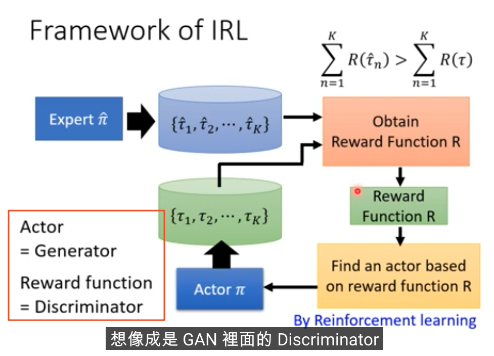

课程资料:      
https://speech.ee.ntu.edu.tw/~hylee/ml/2021-spring.php   2021春季RL课程      
https://www.youtube.com/watch?v=73YyF1gmIus      
    
**i.Reward Shaping**    
    挑战点: 稀疏情景下,Sparse Reward; 提前补充一些Reward, 使用领域知识让机器"望梅止渴".     
    注意点:    
        Domin Knowledge需要非常准确    
        e.g. 2016年VizDoom AI竞赛, 需要很好的设计Reward函数    
            a.如果存活= -Reward （避免边缘OB，有趣的设计）        
            b.损失血量= -Reward、击杀敌人= +Reward    
            c.待在原地= -Reward （避免原地不动）    
            d.移动= 9e-5的+Reward    
    
**ii.NoReward**    
    挑战点: 游戏场景下Reward是明确的; 但是真实场景下,人为设定Reward很难是最优的。    
        
    Imitation Learning(模仿学习)    
        a.通过Expert专家的示范，通过Inverse-RL算法训练得到Reward-Function    
        b.Actor想象成Generator、Reward-Func想象成Discriminator    
    
