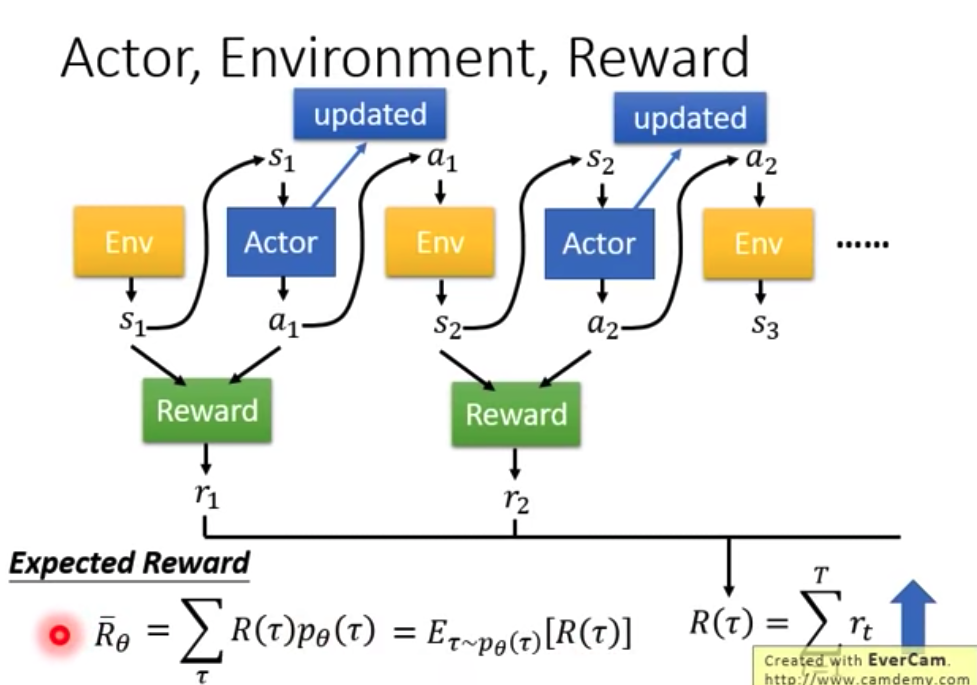
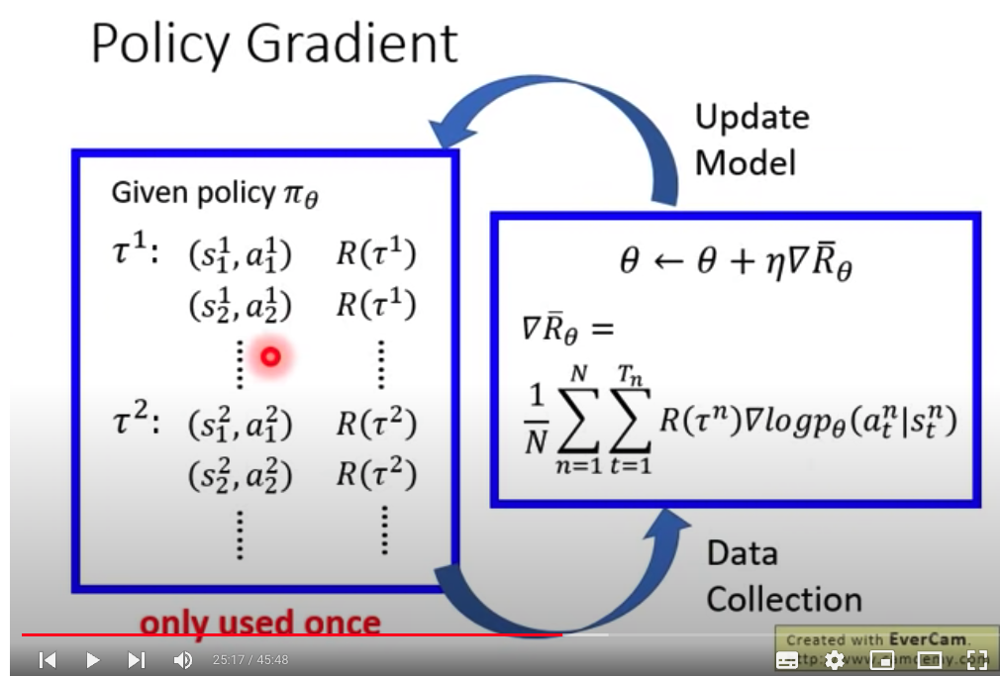

强化学习-PPO基础概念    
https://youtu.be/z95ZYgPgXOY  Policy Gradient(Review)    
https://youtu.be/OAKAZhFmYoI  PPO    
  
**1.Policy Gradient**  
    i.基础知识:  
        Policy = 输入:机器的观察环境的特征  输出:actor目前执行的行为    
        Expected Reward = 奖励的"期望值" （因为由于action、environment的随机性，导致奖励值具有随机性）  
      
  
    ii.如何优化"Reward"的最大值呢？    
        Policy Gradient  
   
        直观理解: 如果State1采用action1，导致最终的Reward是负数，那么就要减少State1采用Action1的概率；否则就增加Action1的概率  
        直观理解: action作为分类问题来选择。  
    
**2.训练技巧tips**    
    i.Reward总是正数,会存在哪些问题？ ==> Add a Baseline Score   
     
    
    ii."Reward"作为Action的权重，会存在哪些问题？ ==> Assign Suitable Credit   

**Proximal Policy Optimization (PPO)**
3.On-Policy Off-Policy
    i. 两者的区别?
        行为策略——不是当前策略，用于产出数据 
        目标策略——会更新的策略，是需要被优化的策略
        如果两个策略是同一个策略，那么我们称为On Policy，在线策略。如果不是同一个策略，那么Off Policy，离线策略

    ii. 转化为off-policy策略
        off-policy的训练数据可以反复使用，训练时长更少。 PPO的作用就是将On-Policy策略转化为Off-Policy策略。
        a.importance sampling

