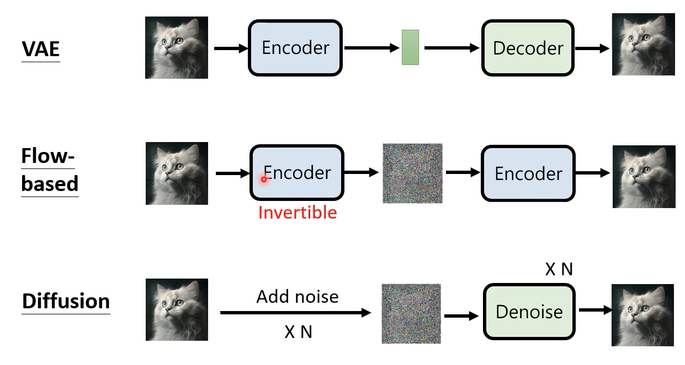
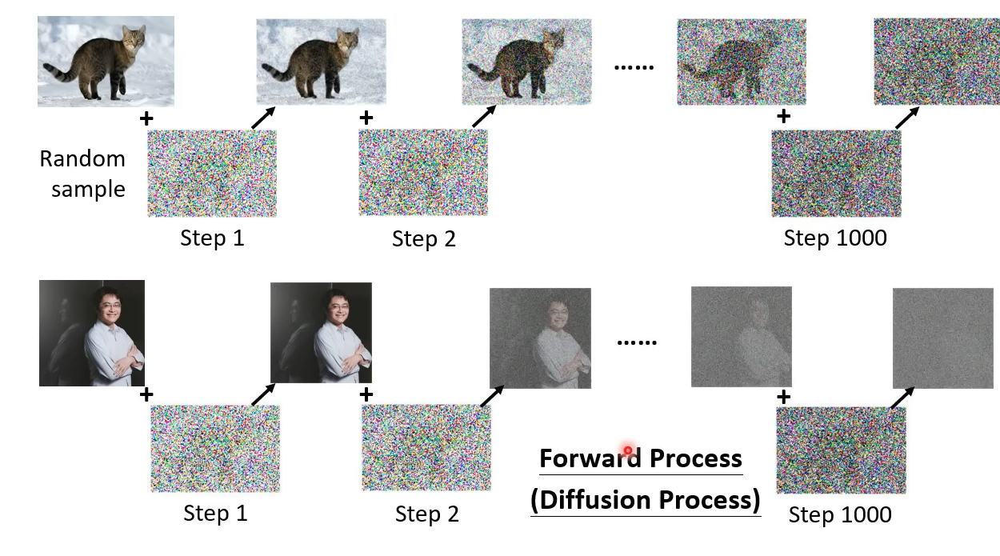
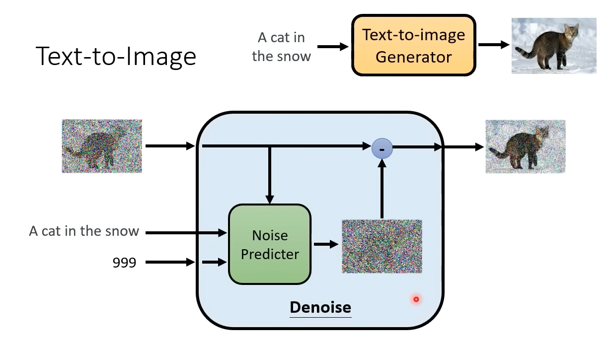

2023春季课程，https://speech.ee.ntu.edu.tw/~hylee/ml/2023-spring.php  
  
**1.生成方式**  
目标: 通过文字生成图像      
i. Auto-Regressive 各个击破  
ii. Non-AutoRegressive 一次到位      
    缺点:输出分布是多样性的，会产生低质量的分布    
    模型的输入: 原始文本文字 + Normal Distribution（某种通用的分布）    
iii.常见模型    
    a. VAE (Variational Auto-Encoder)  Encoder，Decoder两个模块  
    b. Flow-based Generative Model  仅有一个Encoder模块，输入图片，输出Normal Distribuion；Invertible 可逆向的  
    c. Diffusion Model  仅有一个Denoise模块  
    d. GAN,Generative Adversarial Network 仅有一个Decoder模块，作为Generator  
     
  
**2.速览Diffusion Model**    
Denoising Diffusion Probabilistic Models (DDPM模型)  
基本知识:    
    i.输入的"噪声"图片和输出的"真实"图片，Size，是相同的  
    ii.训练流程、GroudTruth的设置  
           
    iii.Denoise Layer的细节  
        输入: step序号，文字，噪声图片   输出:降噪图片  
          
  
**3.速览Stable Diffusion**     
核心点:  
    a.文字Encoder  
    b.文字Embedding + 噪声图片，通过Generator生成"中间"产物Representation  
    c.再通过Decoder生成"真实"图片  
      
  