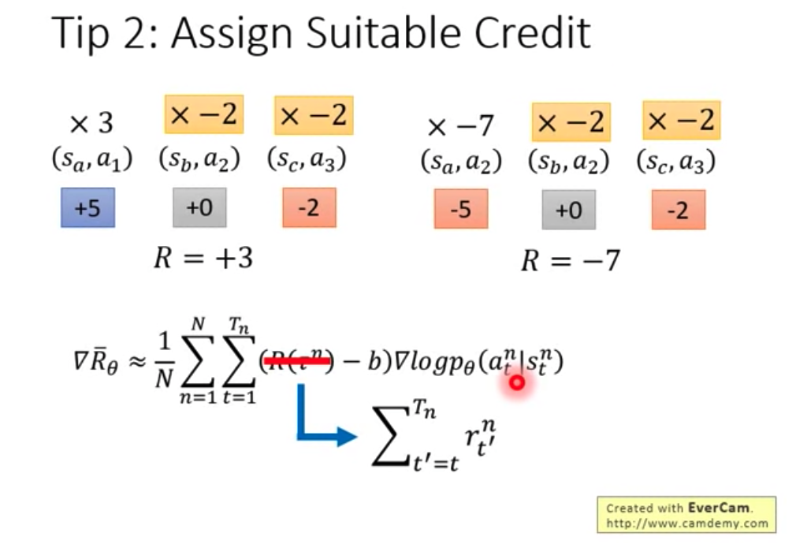

强化学习-PPO基础概念    
https://youtu.be/z95ZYgPgXOY  Policy Gradient(Review)    
https://youtu.be/OAKAZhFmYoI  PPO    
  
1.Policy Gradient  
    i.基础知识:  
        Policy = 输入:机器的观察环境的特征  输出:actor目前执行的行为    
        Expected Reward = 奖励的"期望值" （因为由于action、environment的随机性，导致奖励值具有随机性）  
              
  
    ii.如何优化"Reward"的最大值呢？    
        Policy Gradient  
           
        直观理解: 如果State1采用action1，导致最终的Reward是负数，那么就要减少State1采用Action1的概率；否则就增加Action1的概率  
        直观理解: action作为分类问题来选择。  
    
2.训练技巧tips  
    i.Reward总是正数,会存在哪些问题？ ==> Add a Baseline Score  
       
  
    ii."Reward"作为Action的权重，会存在哪些问题？ ==> Assign Suitable Credit  
    
