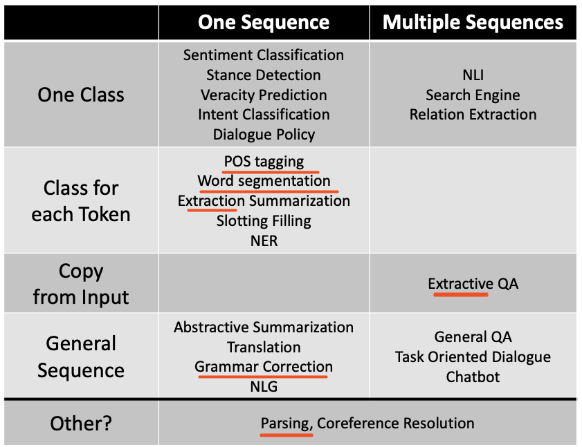
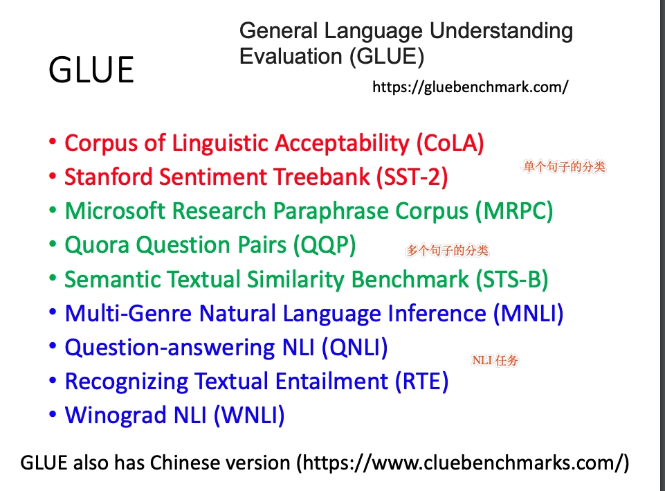

1.基础任务     
输出维度:      
    i.class 分类问题。 sentence-level、token-level        
    ii. seq2seq        
输入维度:        
    i.双塔、单塔        
  
a. Part-of-Speech Tagging 序列标注        
b. Word Segmentation 分词。BMES分类、BI分类        
c. Parsing 句法分析，输出形式: 词性的树状图        
d. Extractive Summarization "抽取"摘要        
e. Abstractive Summarization "抽象、生成"摘要（Copy is encouraged, 单词组合是被鼓励的）        
d. Grammar Error Correction 纠错，Token-Level的3分类问题。（C字符保持不变，Repalce替换字符, Insert插入字符）      
f. Extractive QA. "抽取"问答，输出两个数字: start\end位置（Copy is encouraged, 单词组合是被鼓励的）        
g. Slot-Filling. 类似于POS序列标注任务      
h. Knowledge Graph.  包含: Named Entity Recognition; Relation Extraction      
      
评估集合: General Language Understanding Evaluation (GLUE)      
      
          
          