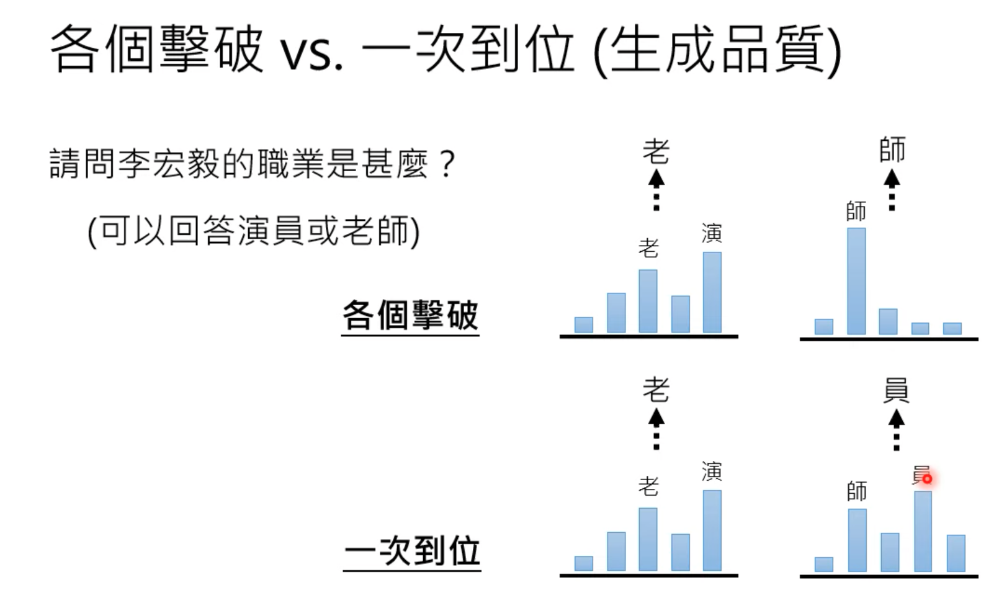
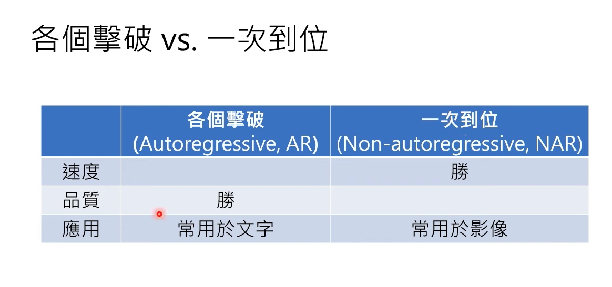
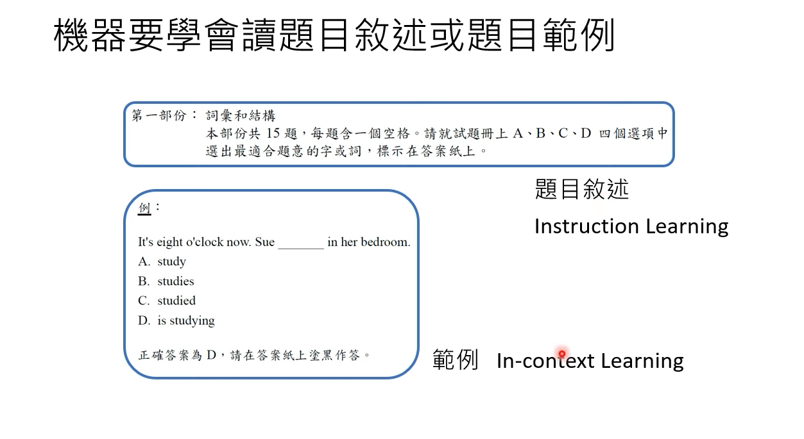
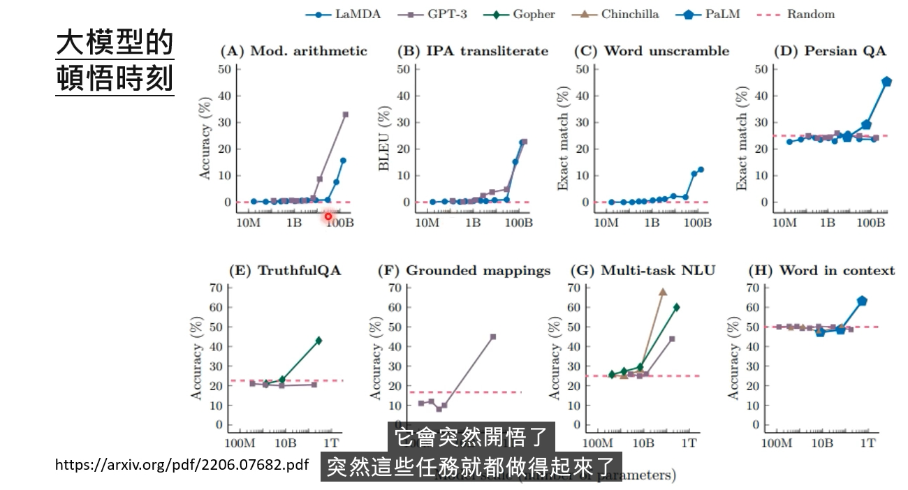
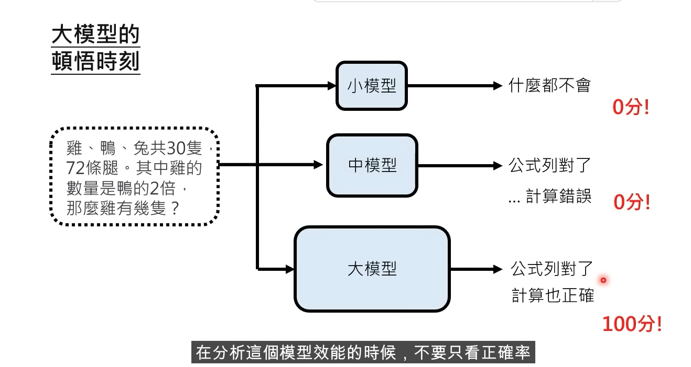
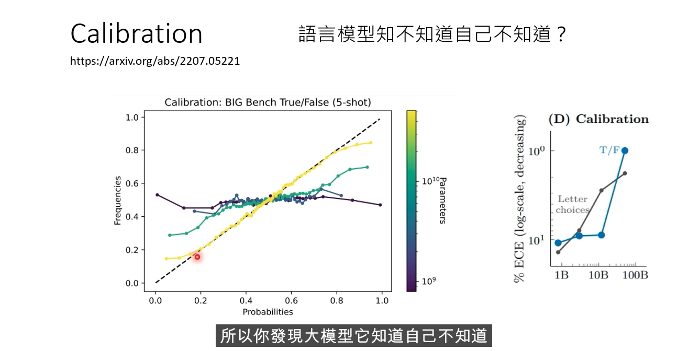
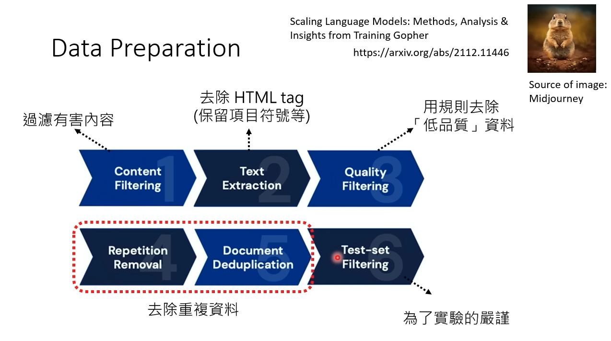
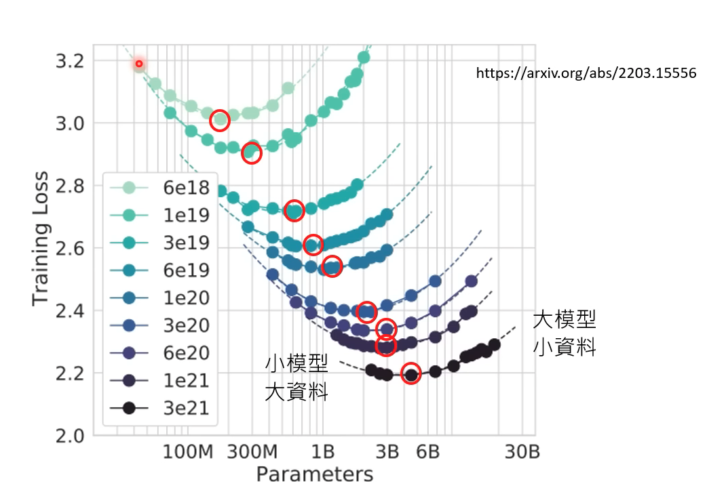
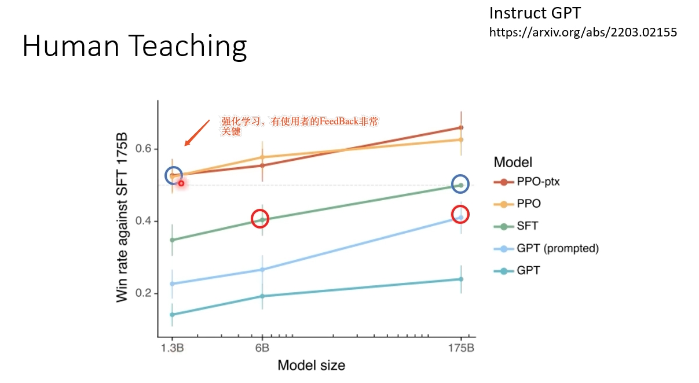

**1.生成式学习的两种策略: 各个击破、一次到位**
李宏毅老师: https://www.youtube.com/watch?v=AihBniegMKg      
    语句（由Tokens组成)、影像（由Piexl组成）、语音（由取样点组成）  
  
e.g. 各个击破、一次到位，对比其生成品质  
               
       
  
e.g. 各个击破、一次到位 组合两者    
    语音: "各个击破"先产生中间向量（决定大方向），接着用"一次到位"（生成所有取样点）  
    图像: "N次到位", 逐步从"模糊"的图片变得更加"清晰"  (Diffiusion Model)  
    
**2.能够使用搜索引擎的AI**   
李宏毅老师: https://www.youtube.com/watch?v=ZID220t_MpI   
    New Bing，微软 2023年2月，https://blogs.bing.com/search-quality-insights/february-2023/Building-the-New-Bing    
    WebGPT，openAI 2021年12月，https://arxiv.org/abs/2112.09332    
        GPT-3预训练，监督学习，强化学习    
    Toolformer，metaAI，2023年2月，https://arxiv.org/abs/2302.04761   搜寻、翻译器、算数计算器   
  
   
**3.Finetuning专才 VS Prompt通才**   
Finetuning: （专才）   
    i. Head-Layer, 需要微调整个模型。 缺点:GPT-3参数量很大，如果存在100个任务，则会保存100个大模型参数。   
    ii. Adapter, 冻结原始的模型参数，仅仅训练各式各样的Adapter。  优点:仅仅需要保留adapter参数   
       
Zero-Shot: (通才)   
核心思路: 所有的NLP任务的本质都是QA问答   
    In-Context Learning: 给一些范例，再提问. 文字接龙=唤醒模型记忆   
    Instruction Learning: 给题目的描述，再提问. 文字接龙=唤醒模型记忆   
    Chain-Of-Thought Prompting: 文本模版=think step by step, diversity   
    
       
**4.顿悟时刻 Emergent-Ability 涌动现象**    
i.模型参数量的重要性 （存在置信度概念，大模型生成答案时会存在"心虚"时刻）      
       
         
  
       
ii.资料训练量的重要性              
    数据预处理: 过滤低质量语料、重复的预料。 Gopher论文         
         
    小模型+大资料（学而不思则罔）VS 大模型+小资料（思而不学则殆）； 选择中间点更加合适          
         
    InstructGPT论文:       
        1.3Billion、10亿参数量的模型+有监督学习+人类使用者的Feedback，效果好于，175Billion的模型+有监督学习         
        reinforcement Learning强化学习的重要性         
       

iii.KNN LM（deep-mind团队，Retro论文）  

**5.GPT4**
GPT3.5 = ChatGPT
GPT4 "读取"图像的能力； 鸡鸭兔同笼问题，结果多样性减少，更加收敛了。 Calibration 置信度的评估。

